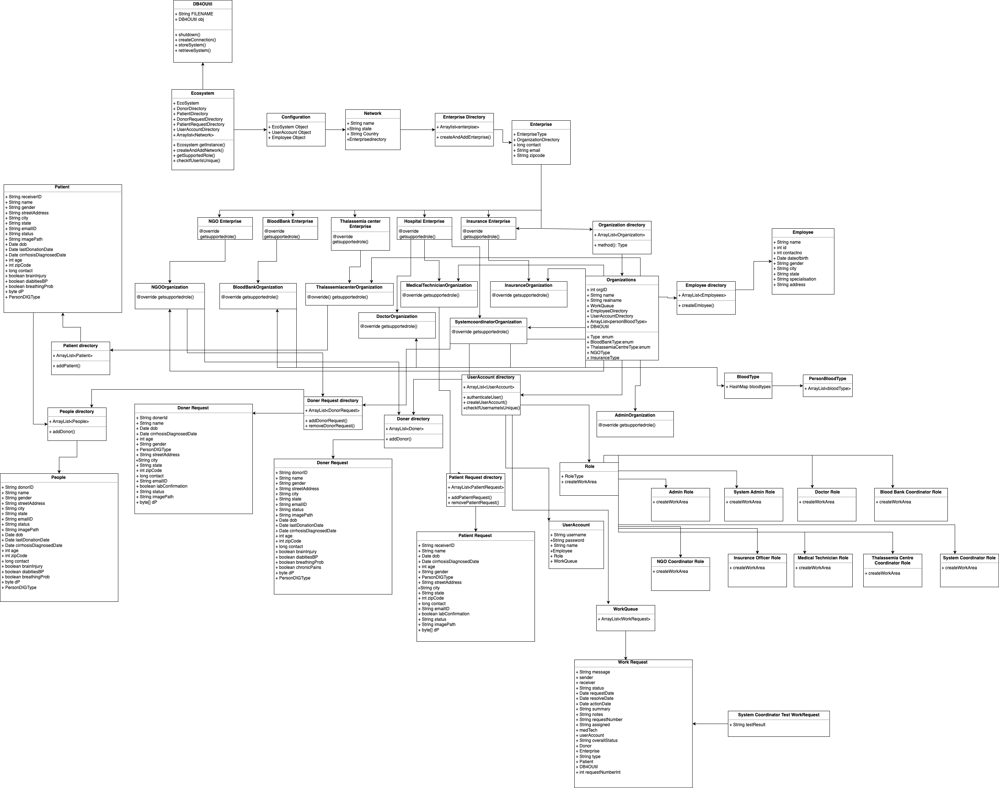
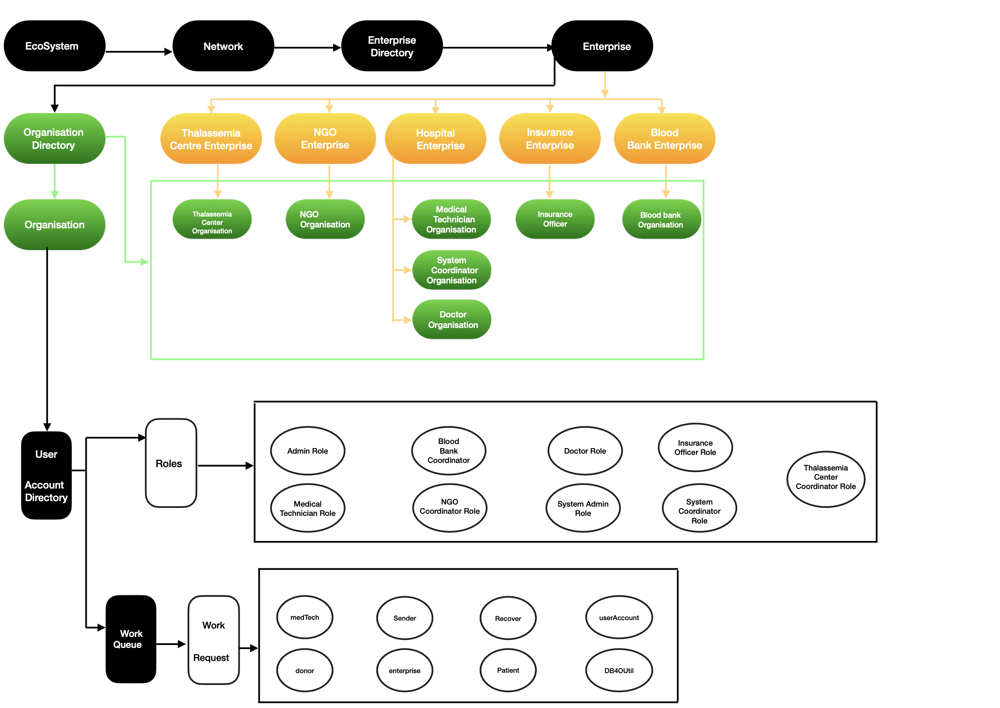

# Thalassemia
 ## Introduction
 This project aims to integrate the database, maps, and email systems to create a complete platform for thalassemia treatment. The ecosystem includes enterprises such as diagnostic, government, hospital, NGO, and blood bank. Each enterprise has different organizations that are responsible for different roles.

 ## Enterprises
 1. **Thalassemia Centre Enterprise**: Responsible for the diagnosis of Thalassemia. It has a **Thalassemia Center Organization** responsible for lab tests and a **System Admin Role** responsible for managing the system.
2. **Insurance Enterprise**: Responsible for coordinating with the government for funding and other support. It has a **Insurance Organization** responsible for managing government affairs and a **NGO Coordinator Role** responsible for coordinating with the government.
3. **Hospital Enterprise**: Responsible for the treatment of Thalassemia. It has a **Medical Technician Organization** responsible for medical tests, a **System Coordinator Organization** responsible for managing the system, and a **Doctor Organization** responsible for the treatment of patients.
4. **NGO Enterprise**: Responsible for creating awareness about Thalassemia and providing support to patients. It has an **NGO Organization** responsible for managing NGO affairs and an **NGO Role** responsible for providing support to patients.
5. **Blood Bank Enterprise**: Responsible for managing blood banks and providing blood to patients. It has a **Blood Bank Organization** responsible for managing blood banks and a **Blood Bank Role** responsible for providing blood to patients.

## Organizations

1. **Lab Technician Organization**: Responsible for lab tests. It has a System Admin Role responsible for managing the system and a Lab Technician Role responsible for conducting lab tests.
2. **Government Organization**: Responsible for managing government affairs. It has a Government Coordinator Role responsible for coordinating with the government.
3. **Medical Technician Organization**: Responsible for medical tests. It has a Medical Technician Role responsible for conducting medical tests.
4. **System Coordinator Organization**: Responsible for managing the system. It has a System Coordinator Role responsible for managing the system.
5. **Doctor Organization**: Responsible for the treatment of patients. It has a Doctor Role responsible for treating patients.
6. **NGO Coordinator Organization**: Responsible for managing NGO affairs. It has an NGO Role responsible for providing support to patients.
7. **Blood Bank Coordinator**: Responsible for managing blood banks. It has a Blood Bank Role responsible for providing blood to patients.

## Roles
1. **Admin Role**: Responsible for adding and managing networks. Each network has several Enterprises and Enterprises further will have Roles for the purpose they serve.
2. **Medicial Technician Role**: Responsible for medical tests. It has a Medical Technician Role responsible for conducting medical tests.
3. **Blood Bank Coordinator Role**: Responsible for managing blood banks. It has a Blood Bank Role responsible for providing blood to patients. 
4. **NGO Coordinator**: Responsible for managing NGO affairs. It has an NGO Role responsible for providing support to patients.
5. **Doctor Role**: Responsible for the treatment of patients. It has a Doctor Role responsible for treating patients.
6. **System Admin Role**: Each Enterprise will have an admin who will manage organizations, add/remove employees.
7. **Insurance Officer Role**: Responsible for a hassle free and seamless process of eliminating the paperwork by having the insurance forms taken care within the system and making it easy for the patient.
8. **System Coordinator Role**: esponsible for managing the system. It has a System Coordinator Role responsible for managing the system.
9. **Thalassemia Center Coordinator Role**: Approves the donors by checking their eligibility to donate blood. As everyone cannot donate blood for Thalassemia blood disease.

## Work Requests

The work requests will go to the organizations and from there to the respective organizations responsible for the role. For example, if a patient needs a blood transfusion, the request will go to the **Blood Bank Organization** and then to the **Blood Bank Role** responsible for providing blood to patients. Similarly, if a patient needs a lab test, the request will go to the **Diagnostic Enterprise**, then to the **Lab Technician Organization**, and then to the **Lab Technician Role** responsible for conducting lab tests.

---
---

# DB4OUtil(Database)
This is a Java class that provides the implementation of the database layer for persisting objects. It uses the db4o object database to store and retrieve objects in a file-based system.

## Getting Started
The DB4OUtil class is part of the Business package, which contains classes that implement the business logic of the application. To use the DB4OUtil class, you need to add the Business package to your project.

## Prerequisites

The DB4OUtil class requires the following dependencies:

- db4o-8.0.184.15484-all-java5.jar

## Installing
1. Download the [db4o jar](https://jar-download.com/?search_box=db4o) and add it to your project's build path.

2. Copy the DB4OUtil class to your project.

## Creating a Connection
To create a connection to the database, call the createConnection() method. This method returns an ObjectContainer instance.

## Storing Objects

To store an object in the database, call the storeSystem() method, passing the object to be stored as a parameter. This method creates a new connection to the database, stores the object, and then commits the changes to the database.

## Retrieving Objects

To retrieve an object from the database, call the retrieveSystem() method. This method creates a new connection to the database, retrieves the object, and then closes the connection.

---
---

# Email Sender

This is a Java code that sends an email using the Simple Mail Transfer Protocol (SMTP).

## How it Works
The code sets up the properties required to connect to the Gmail SMTP server, including the host name, port, and authentication information. Then, it creates an email session using these properties and an authenticator object that provides the sender's email address and password.

Once the session is created, the code creates an email message with the recipient's email address, subject, and body. Finally, it sends the message using the Transport class and prints a success message if the email is sent successfully.

## Prerequisites
- Java Development Kit (JDK)
- Access to an email account (e.g., Gmail)
- Internet connection

## Dependencies
This code requires the following dependencies to be imported:

- javax.mail package: provides classes and interfaces for sending email using the SMTP protocol.
- java.util package: provides utility classes for working with properties.

## Usage

To use this code, replace the following placeholders with your email information:

- smtp.gmail.com: your SMTP server hostname
- 465: your SMTP server port number

Also, make sure that you have granted access to less secure apps in your email account settings (for Gmail users).

### References
For more information on the javax.mail package and how to send email using Java, check out the following resources:

[JavaMail API documentation](https://javaee.github.io/javamail/)

[Sending Email in Java using Gmail SMTP with SSL/TLS Authentication](https://www.geeksforgeeks.org/sending-email-java-ssltls-authentication/)

---
---

# Maps Code
We used Java code snippet that uses the Google Maps API to search for a location entered by the user and opens the location in the default browser.

## How it Works
The code takes a location input from the user and checks if it is empty or not. If it is empty, an error message is displayed to the user. If not, the location is encoded using UTF-8 encoding and a URI is created using the Google Maps API with the encoded location. The URI is then opened in the default browser using the Desktop class. If the Desktop class is not supported, an error message is displayed to the user.

## Usage

To use this code, you need to have the Google Maps API key. You can get the API key by following the instructions on the Google Maps Platform documentation. Once you have the API key, you can replace the API_KEY placeholder in the URI with your API key.

To run the code, simply copy and paste it into your Java project and call the method where you want to use it. You will also need to import the necessary packages at the beginning of your Java file.

--- 
[UML Diagram](https://drive.google.com/file/d/11118oE77m2ULjBixPUJvflpf-aJvFI5X/view?usp=sharing)

---
High Level Component Diagram

